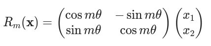
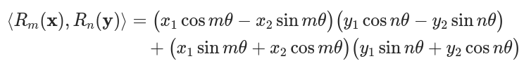
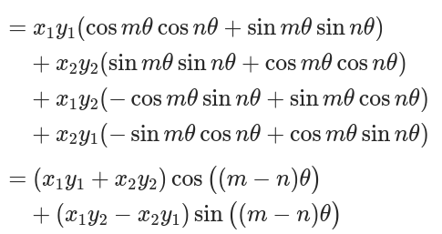
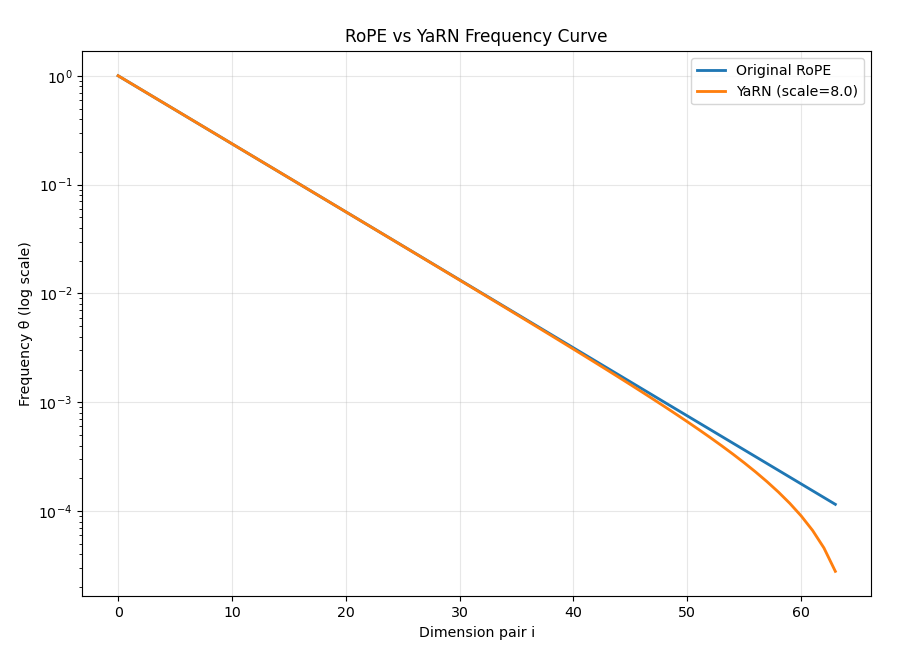

# 位置编码：RoPE 与 YaRN

Transformer 中给 token 添加位置信息的两种方法：旋转位置编码（RoPE）及其优化扩展（YaRN）。

## RoPE（旋转位置编码）

位置编码器。为原本独立的token添加位置信息。

如果重新观察attention的计算过程，也许就会发现，输入的token都是各自独立的，token之间没有任何关系可以表示。但这肯定是不合适的，文字的排列本身就包含了大量的信息。因此我们需要通过一些手段给token添加一种可以表示位置的信息。

添加位置信息有两种方式：绝对位置编码和相对位置编码。

绝对位置编码，比如给每个token添加一个顺序的数字。
这就是最开始使用的方法，这种方式十分直观，简单易懂。
但是这种编码方式存在着巨大缺陷，绝对位置的注意力容易被限制，泛化能力不足。这种绝对位置编码也会让模型学习到绝对的位置信息，很难学习到灵活变化的语言的规律，模型也容易因为后面的大数字训练数据减少而导致泛化性能急剧降低。

因此现在一般使用相对位置编码。比如RoPE（旋转位置编码）。

RoPE会根据每个token的位置和token内部每个不同的维度将数据进行不同的旋转：

把每个token的q（或k）向量按相邻维度两两拆分成dim/2对，每一对乘一个角度为m·ωᵢ的2×2旋转矩阵。其中m是token的位置，ωᵢ是该维度对对应的频率（可以理解为所处维度，每一个对都分配到一个用于描述旋转速度的频率，一般从开始到结束，频率从高到低）。

这样，不同位置的token旋转角度不同，同一token内不同维度对的旋转角度也不同。而q和k使用同一套角度进行旋转，因此两者都不再带绝对位置信息，旋转后q·kᵀ的结果中只保留相对位置信息m-n，这正好符合相对位置编码的诉求。

### 数学原理

对于位置m，向量x=(x₁,x₂)旋转：



同理位置 n：Rn(y)。

计算旋转后的内积：



化简：



最后可以发现，因为x,y均是已知的，所以两个token之间的关系仅仅由m-n决定。

### 频率公式

$\text{freqs}_k = \frac{1}{\text{rope\_base}^{2k / \text{dim}}}, \quad k = 0, 1, \dots, \frac{\text{dim}}{2} - 1$

这就是RoPE的实现。

rope会同时操作q和k，用cos(freqs)和sin(freqs)对每个维度对做旋转组合运算（维度对内两个维度都同时参与：a'=a·cosθ−b·sinθ，b'=a·sinθ+b·cosθ）。

从公式中可以看出，rope会对不同的token的同一维度旋转不同的角度。

对同一token的不同维度提供不同的频率的旋转。

高维度旋转慢，能够覆盖超长文本，感知全局。

低维度旋转快，对附近的token十分敏感，能够捕捉附近信息。

这样子的差异就为token提供了覆盖远近不同的位置信息。

## YaRN

YaRN就是对RoPE的优化。

原本RoPE的频率分布是一个开始时高频、随后指数衰减的曲线。

而YaRN所作的就是优化这条频率曲线，让模型能够通过有选择的拉伸频率就能获得更长的上下文长度，如图：



图中可以明显看见YaRN针对 50对 以后的低频部分和rope有明显变化，就是这一部分优化让位置编码在低频部分能够保证对长文本的有效覆盖。

除此之外YaRN在高频和低频之间的过渡部分，使用插值的方法平滑过渡曲线。
高频部分保持不变，以保留原本模型的近距离感知能力。

在实际使用中，通常基础训练只使用rope，待基础训练完成后再启用YaRN，并分阶段逐步扩大上下文长度（如DeepSeek v3的4K→32K→128K），就可以获得更加优秀的长文本能力。

### 原生长上下文 vs 后期扩展

同样是百万级别的上下文，不同模型的长文本能力差别很大，根源在于上下文是"原生训练"出来的，还是"后期扩展"出来的。

| | 原生长上下文 | 后期扩展 |
|---|---|---|
| 代表 | MiniMax-Text-01（训练即1M，推理可达4M）、Gemini 1.5 | DeepSeek-V3（4K→32K→128K）、Qwen、Llama 3.1 |
| 做法 | 从零就用百万级长序列训练，并配合稀疏/线性注意力等架构 | 先用短上下文训练，再用YaRN/NTK等方法扩长（可配少量继续训练） |
| 长文本表现 | 退化最小，能力几乎随长度持平 | 长程任务明显弱于原生模型 |

原因在于：原生训练的模型在长序列上真正学会了"远处的token该如何关联"；而后期扩展只是把位置编码的"尺子"拉长（YaRN），模型训练时基本没怎么见过长序列，对远处token的注意力模式是靠插值硬撑的，所以容易退化。YaRN只是提供了一把更长的尺子，能力能不能保持，取决于模型是否真的在长序列上学到过东西。

## 代码实现

需要 `import torch, math`。

```Python
#预计算频率，提前将sin和cos打表，减少训练时候的计算量

#参数说明：
# dim          : head维度（head_dim），dim//2=频率对（维度对）数量，决定频率表长度与粒度
# end          : 预计算的最大位置数，即想支持的最大上下文长度，最终表形状为(end, dim)
# rope_base    : 频率基数，freqs_k=base^(-2k/dim)。base越大频率越低、旋转越慢、覆盖越长。
#                原始RoPE用1e4，LLaMA-3.1用5e5(128k)，这里1e6大致对应32k
# rope_scaling : None=原生RoPE；dict=启用YaRN，各键含义见下方字典内的注释
def precompute_freqs_cis(dim: int, end: int = int(32 * 1024), rope_base: float = 1e6, rope_scaling: dict = None):
    #这里的rope就决定了大模型的最大输出长度。相当于底子。
    #这个是根据数据集的样本平均长度决定的，通常会比平均长度稍微多一点
    #L_max≈rope_base^(2/d)，这里设定1e6说明标准rope最大支持32k上下文。使用yarn可以推广到64k-128k
    freqs, attn_factor = 1.0 / (rope_base ** (torch.arange(0, dim, 2)[: (dim // 2)].float() / dim)), 1.0

    #----------------------------------
    #YaRN实现
    if rope_scaling is not None: # YaRN: f'(i) = f(i)((1-γ) + γ/s), where γ∈[0,1] is linear ramp
        orig_max, factor, beta_fast, beta_slow, attn_factor = (
            rope_scaling.get("original_max_position_embeddings", 2048),  #原训练上下文长度：end/orig_max>1才启用YaRN，并参与ramp边界计算
            rope_scaling.get("factor", 16),                              #扩长倍数=目标长度÷原长度，低频频率÷factor、波长拉长factor倍
            rope_scaling.get("beta_fast", 32.0),                         #ramp低频端边界：索引<inv_dim(32)的高频维度频率保持不变
            rope_scaling.get("beta_slow", 1.0),                          #ramp高频端边界：索引>inv_dim(1)的低频维度频率÷factor
            rope_scaling.get("attention_factor", 1.0)                    #注意力温度：乘在cos/sin上，等效logits乘其平方，默认1.0=不启用
        )#设定参数
        #仅当最大序列长度超过模型支持最大序列长度时开启
        if end / orig_max > 1.0:
            #自动计算低频，中频，高频范围。
            inv_dim = lambda b: (dim * math.log(orig_max / (b * 2 * math.pi))) / (2 * math.log(rope_base))
            low, high = max(math.floor(inv_dim(beta_fast)), 0), min(math.ceil(inv_dim(beta_slow)), dim // 2 - 1)
            #生成频率曲线
            ramp = torch.clamp((torch.arange(dim // 2, device=freqs.device).float() - low) / max(high - low, 0.001), 0, 1)
            freqs = freqs * (1 - ramp + ramp / factor)
    t = torch.arange(end, device=freqs.device)
    freqs = torch.outer(t, freqs).float()
    freqs_cos = torch.cat([torch.cos(freqs), torch.cos(freqs)], dim=-1) * attn_factor
    freqs_sin = torch.cat([torch.sin(freqs), torch.sin(freqs)], dim=-1) * attn_factor
    return freqs_cos, freqs_sin
```

```Python
#应用位置编码
def apply_rotary_pos_emb(q, k, cos, sin, unsqueeze_dim=1):
    def rotate_half(x): return torch.cat((-x[..., x.shape[-1] // 2:], x[..., : x.shape[-1] // 2]), dim=-1)
    q_embed = ((q * cos.unsqueeze(unsqueeze_dim)) + (rotate_half(q) * sin.unsqueeze(unsqueeze_dim))).to(q.dtype)
    k_embed = ((k * cos.unsqueeze(unsqueeze_dim)) + (rotate_half(k) * sin.unsqueeze(unsqueeze_dim))).to(k.dtype)
    return q_embed, k_embed
```
