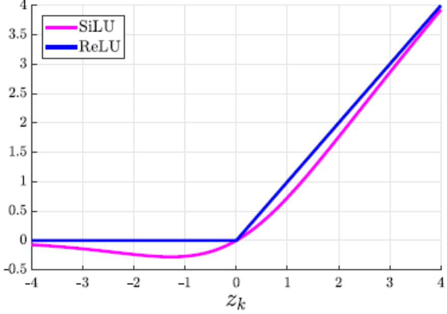

# Feed Foward Network

前馈神经网络，负责将attention提取到的信息进行推理。

这里仅关注ffn本身，残差连接和归一化在拼接模型里面解释。

ffn核心就是三个线性映射和一个非线性的激活函数。

ffn会先将输入进行升维，up\_linear和gate\_linear会同时升维并让gate\_linear通过激活函数做非线性变换。

将变换后的两组数据做对应位置相乘，再将结果通过down\_linear将高维信息总结成低维的结果。


这个就是ffn核心的结构

## 激活函数

激活函数就是为大模型带来推理能力的核心，如果没有激活函数，模型失去非线性，退化为单层网络。y=k1\(k2\*x\)=k3\*x

SiLU和ReLU激活函数图像



这里用ReLU讲解会更加便于理解。激活函数就是在不同的位置为数据做不同的变换，这一点在ReLU上体现十分鲜明。

在大于0的部分，ReLU会将数据对应的乘一个x，数据越大，处理的幅度越大，所以ReLU对偏移较大的数据的敏感度较大。

在小于0的部分，ReLU就会将数据全部归为0，可以理解为将所有无效或者权重较低的信息过滤掉。这样就会突出有效的信息。

而SiLU就是平滑版的ReLU，平滑更加适合求导，解决在0点处导数不存在的问题，也解决ReLU在小于0处完全失去任何信息的问题（无效信息本身也是一种信息，他可以指导模型进行优化，但ReLU把他们全部都砍没了，SiLU的一点平滑处理解决了这个问题）。

当然对于激活函数，还有sigmod等等很多其他的函数，这些就不展开了，详情会放在专门的[激活函数](./激活函数.md)文档里面。

## 线性映射

ffn中的线性映射会先将输入数据升维到intermediate\_size大小。在处理之后再缩回原本的hidden\_size大小。

实际使用通常设置为hidden\_stated的4倍大小

可以理解为人类思考时候脑海内部的抽象空间。

更高维的信息可以抽象出更丰富的信息，并且减少在经过非线性变换的时候损失的信息。

---
线性映射配合激活函数，通过门控机制形成的网络就是ffn的核心，这里使用的组合网络是SwiGLU。
就是图中结构：


向量会被分成两路并升维，一路通过激活函数变换，再和另一路向量点乘得到结果，最后将结果重新映射为原本维度。

从外面看来，这与经过一个普通的激活函数基本一致，不过这里的结构显然能为模型的学习留下更多操作空间。

---

## 代码

```Python
class FeedForward(nn.Module):
    def __init__(self, config: MiniMindConfig, intermediate_size: int = None):
        super().__init__()
        intermediate_size = intermediate_size or config.intermediate_size  # 未指定则用配置里的中间维度
        self.gate_proj = nn.Linear(config.hidden_size, intermediate_size, bias=False)   # 门控层（gate），决定哪些信息有用
        self.down_proj = nn.Linear(intermediate_size, config.hidden_size, bias=False)   # 下采样层（down），压缩回隐藏维度
        self.up_proj = nn.Linear(config.hidden_size, intermediate_size, bias=False)     # 升维层（up），扩张到高维空间
        self.act_fn = ACT2FN[config.hidden_act]                                         # 激活函数（MiniMind 用 SiLU）
        *self*.dropout = nn.Dropout(*config*.dropout)                                   # 随机丢弃，防止过拟合

    def forward(self, x):
        # 1. gate 分支：线性映射 -> SiLU 激活，产出"门控"决定保留多少信息
        # 2. up 分支：线性映射，提供高维的"候选信息"
        # 3. 两者逐元素相乘 = SwiGLU：门控放行的信息再经 down 压缩回 hidden_size
        return self.dropout(self.down_proj(self.act_fn(self.gate_proj(x)) * self.up_proj(x)))
```
