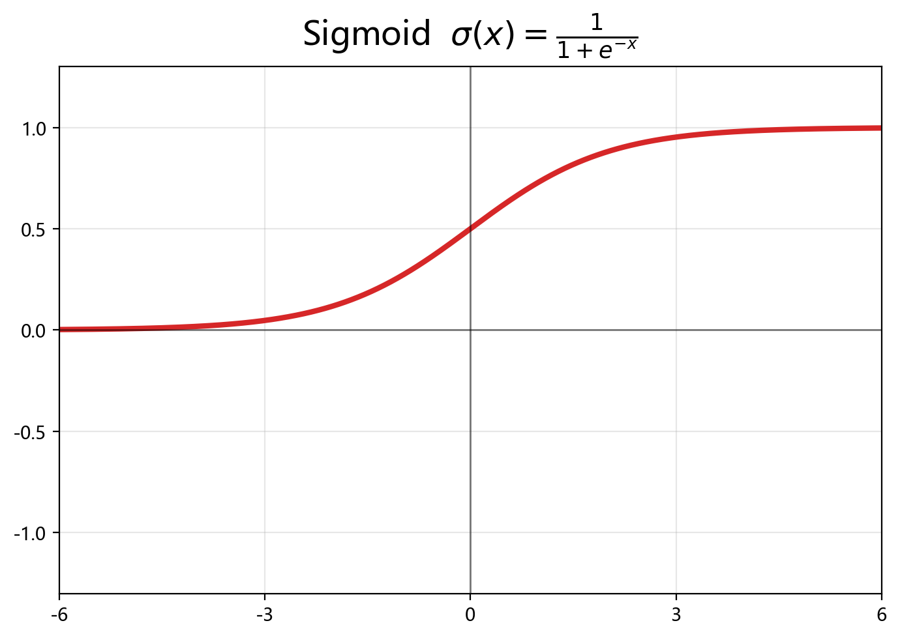
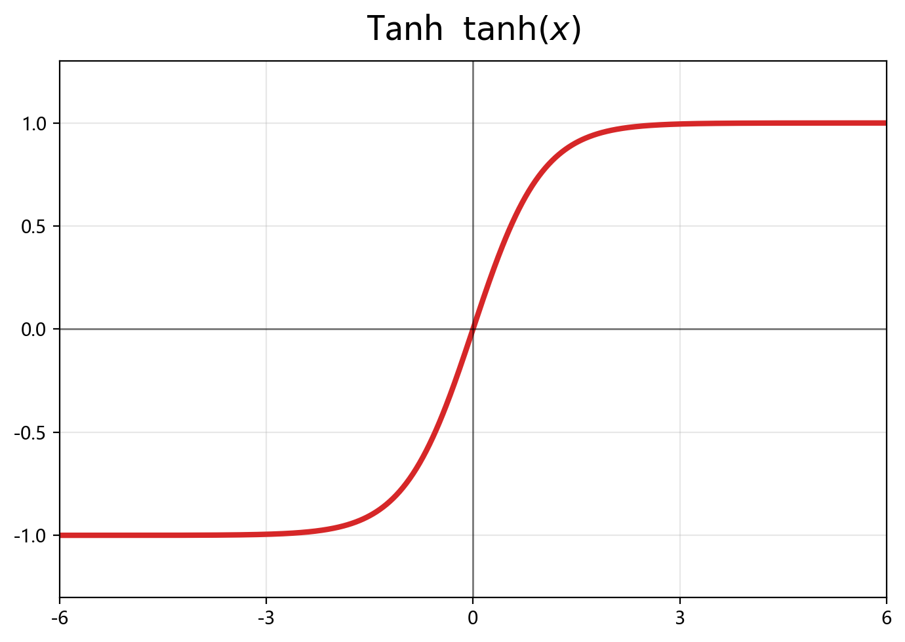
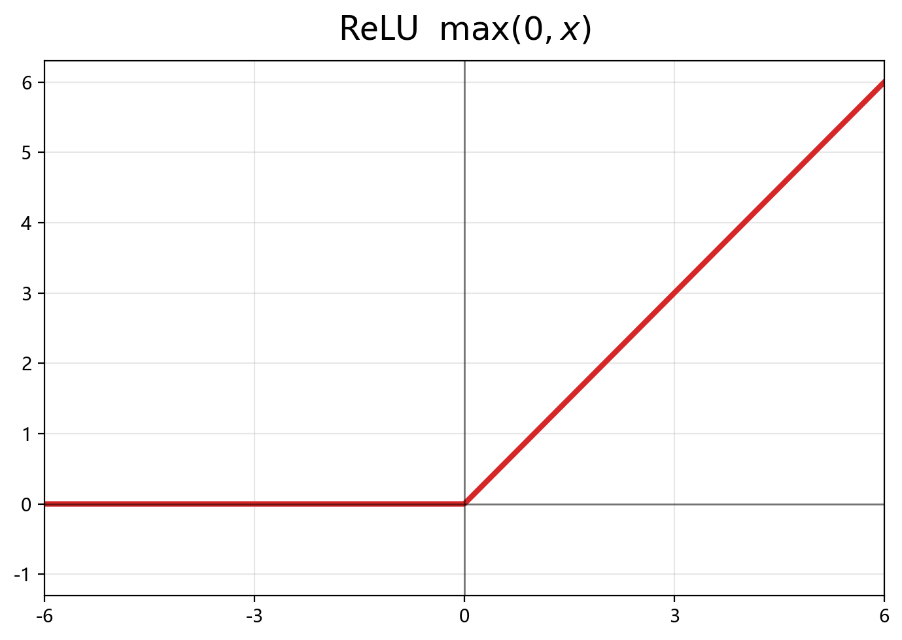
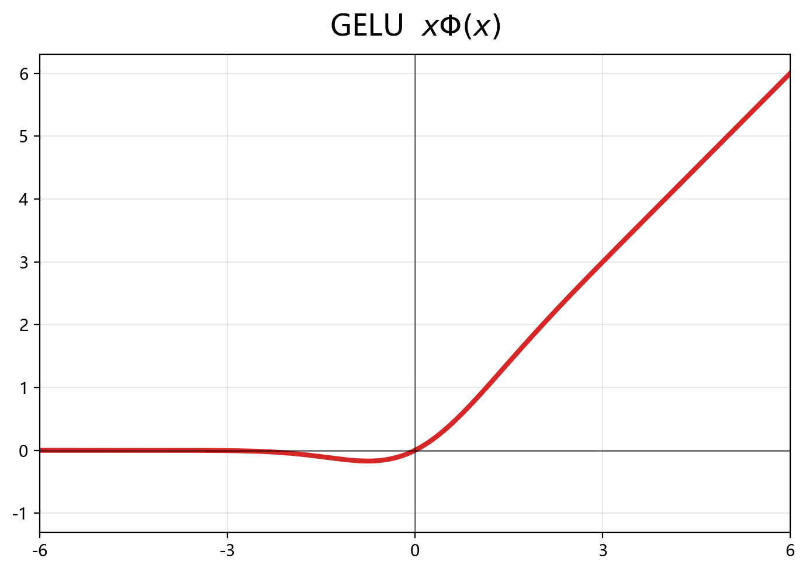
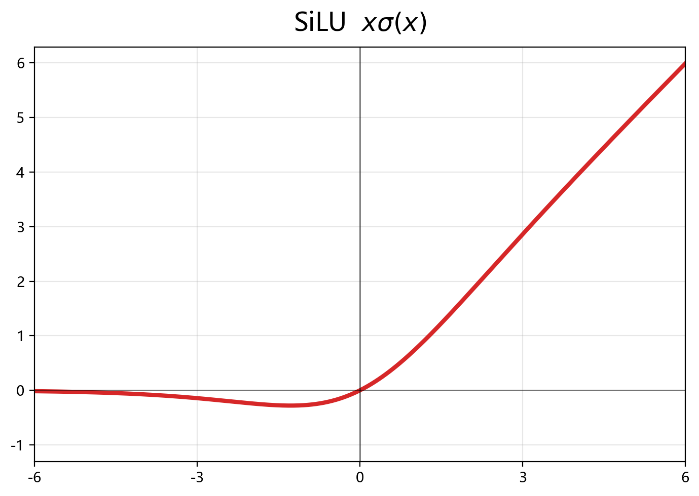
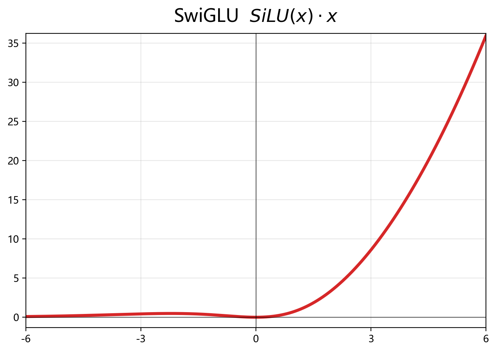
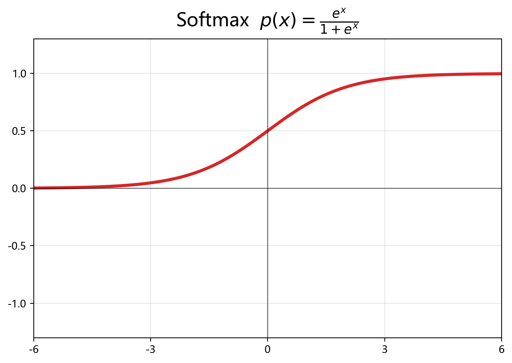
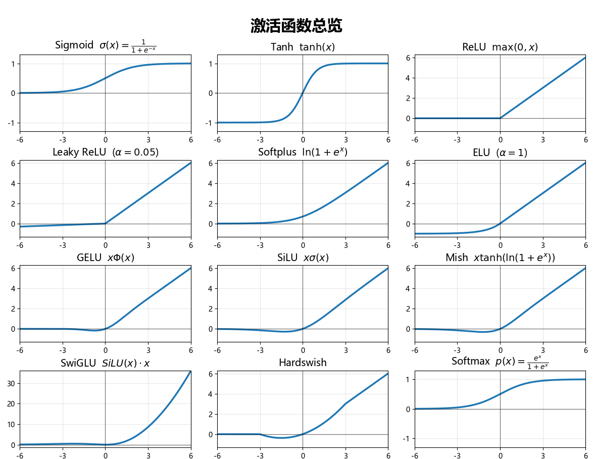

# 激活函数

激活函数是神经网络中非线性能力的来源，如果没有激活函数，无论堆叠多少层，模型都只能等效于一个单层线性变换。

激活函数的发展大致沿着这样几条线演进：解决梯度消失 -> 简化计算 -> 保留负区信息 -> 门控化。

这里会罗列并总结各个激活函数的特点，大致按照发展顺序排序。

## Sigmoid

$$s(x) = \frac{1}{1 + e^{-x}}$$

最早的常用激活函数之一，输入任何实数，输出被压缩到 (0, 1) 区间。

优点：
- 处处可导，适合梯度下降
- 输出可以看成一个概率或"开/关"程度，适合作为门控

缺点：
- 两端饱和，导数趋近于0，深层网络中梯度逐层相乘，很快就消失了（**梯度消失**）
- 输出**不以 0 为中心**（全为正），容易让后续层的梯度方向单一，收敛慢
- 含指数运算，计算开销较大

## Tanh

$$\tanh(x) = \frac{e^x - e^{-x}}{e^x + e^{-x}} = 2\sigma(2x) - 1$$

相当于把 sigmoid 做了平移缩放，值域变成 (-1, 1)，**输出以 0 为中心**，收敛速度比 sigmoid 快。

但它的两端同样饱和，**梯度消失问题依然存在**。所以 sigmoid/tanh 时代堆层数很困难，这也是早期网络"深度"上不去的直接原因。

## ReLU

$$\text{ReLU}(x) = \max(0, x)$$

深度学习真正发展的关键。

优点：
- 正区间导数恒为 1，梯度可以不受衰减地传播，极大缓解梯度消失
- 计算极简（一个 max），比指数运算快得多
- 负数直接归 0，引入稀疏性，突出有效信息

缺点：
- 负数部分导数恒为 0，一旦某神经元输出恒为负，"该维度就再也没法更新了"，称为**神经元死亡**（dead ReLU）
- 在 0 点处不可导（虽然工程上直接取左边/右边的值就行）
- 负数被彻底砍掉，一部分信息也一起丢失

## Leaky ReLU / PReLU / ELU

针对 ReLU 的负数死亡问题做的修补：

- **Leaky ReLU**：负数部分乘一个很小的斜率 α，比如 0.01，给负区留了一线生机
- **PReLU**：这个斜率 α 不是固定的，而是一个可学习参数，随模型一起训练
- **ELU**：负数部分用指数曲线过渡，负区不是直线而是平滑衰减

这些方案保留了 ReLU 正区间的好处，同时让负数不完全"死亡"，但后来又发现，有时 ReLU 那种"砍干净"的稀疏特性反而有用，所以这些替代品没有成为绝对主流。

## GELU

$$\text{GELU}(x) = x \cdot \Phi(x)$$

其中 $\Phi(x)$ 是标准正态分布的累积分布函数（可近似为 $x \cdot \sigma(1.702x)$）。

用输入本身的值当权重"软性筛选"数据：正的数据被保留，负的数据被压缩而不是直接砍零。BERT 等早期 Transformer 大量使用。

## SiLU（Swish）

$$\text{SiLU}(x) = x \cdot \sigma(x) = \frac{x}{1 + e^{-x}}$$

可以看作 GELU 的简化和 ReLU 的平滑版。

优点：
- 处处可导，没有 ReLU 在 0 点的求导问题
- 曲线平滑，接近 0 的地方有渐变，比 ReLU 更利于梯度流动
- 负区不会彻底归 0，保留了被 ReLU 砍掉的"弱信息"（弱信息本身也是信息，可以指导模型优化）
- 无明显饱和区，缓解梯度消失

缺点：
- 含有 sigmoid，计算量比 ReLU 大一点
- 值域包含负数，模型输出需要自行处理

## SwiGLU

$$\text{SwiGLU}(x) = \text{SiLU}(xW_g) \odot (xW_u)$$

> SwiGLU 本身不是一个新的激活函数，而是把 SiLU 组合进 GLU（门控线性单元）形成的结构。

GLU 的思想来自 LSTM 的门控：把信息流拆成两路，一路负责"传输内容"，一路负责"决定放行多少"。在 FFN 里具体表现为：

1. 输入 x 同时经过 `gate_proj` 和 `up_proj` 两个线性层升维
2. 一路经过 SiLU 激活后当作门控，决定每维信息保留多少
3. 另一路原样作为候选信息
4. 两者逐元素相乘，再经 `down_proj` 压回原来的维度

$$\text{output} = \text{down}(\ \text{SiLU}(\text{gate}(x)) \odot \text{up}(x)\ )$$

这种"激活+门控"的组合给模型留出了更多操作空间，表达能力优于单一激活函数，是目前大模型的主流做法。

## 补充：其他激活函数

除了主线上的几个，还有不少激活函数有实际应用场景，简单罗列：

**Softmax**

$$\text{softmax}(z_i) = \frac{e^{z_i}}{\sum_{j=1}^{n} e^{z_j}}$$

把一组任意实数压缩成和为 1 的概率分布，突出最大值又保留相对关系。它与前面的激活函数不同：它不是单点的非线性变换，而是对整个向量做归一化，因此常用于模型的**输出层（分类、词表预测）**和 attention 里把注意力权重变成比率。

- 缺点：含指数运算计算量大；对输入比较"敏感"，一个值偏大会吃掉其他所有值的概率（所以有 temperature 之类的软化手段）；不会产生稀疏结果（每个位置都非 0）。

**Sparsemax / Entmax**——Softmax 的稀疏化变体，可以让某些位置的概率严格变成 0，输出更"刚性"，但工程上用得不广。

**Softplus**

$$\text{Softplus}(x) = \ln(1 + e^x)$$

ReLU 的平滑版，处处可导，但没有 ReLU 的稀疏性，还要算对数指数，计算开销大，实际用得少。

**Hardswish / Hardsigmoid**

SiLU 和 sigmoid 的分段线性近似，用几段直线代替曲线，去掉指数运算换取计算速度，MobileNet 系列移动端网络常用。

**Mish**

$$\text{Mish}(x) = x \cdot \tanh(\ln(1 + e^x)) = x \cdot \tanh(\text{softplus}(x))$$

形状类似 SiLU，也是一个"平滑激活"的尝试，效果与 SiLU 相近，未成为主流。

**GeGLU / ReGLU / GLU**

SwiGLU 的活跃度家族：把门控分支里的 SiLU 换成 GELU（GeGLU）、ReLU（ReGLU）或干脆不加激活（GLU）。底层思想相同，都是"候选信息 × 门控"。

说明：SwiGLU 在今天占据绝对主流，一是 SiLU 本身的平滑性好，二是工程实现简单高效；其他变体在个别模型（如部分过时 LLM 用 GeGLU）里出现过。

**LeCun Tanh / Softsign** 等，都是 tanh 的一些数值上更稳或收敛更快的变体，本质差别不大。

> 主线之外的大多数函数，都是"某个主流激活函数的平滑近似"或"门控组合"，真正独当一面的并不多。给模型选激活函数，往往是选结构（如 FFN 里的门控结构）和数值特性（平滑、稀疏、计算快）。

## 对比总览

| 函数 | 公式 | 以0为中心 | 负区处理 | 主要问题/特点 |
| - | - | - | - | - |
| Sigmoid | $1/(1+e^{-x})$ | 否 | 保留 | 梯度消失、计算慢 |
| Tanh | $2\sigma(2x)-1$ | 是 | 保留 | 仍会梯度消失 |
| ReLU | $\max(0,x)$ | 否 | 砍零 | 神经元死亡、0点不可导 |
| Leaky ReLU | $\max(αx,x)$ | 否 | 小斜率 | 缓解死亡 |
| GELU | $x\cdot\Phi(x)$ | 否 | 软压缩 | BERT 时代常用 |
| SiLU | $x\cdot\sigma(x)$ | 否 | 软保留 | 平滑、无死亡，MiniMind 用 |
| SwiGLU | $\text{SiLU}(xW_g)\odot(xW_u)$ | - | - | 门控结构，现役主流 |
| Softmax | $e^{z_i}/\sum e^{z_j}$ | - | - | 向量归一成概率，用于输出层/注意力 |

