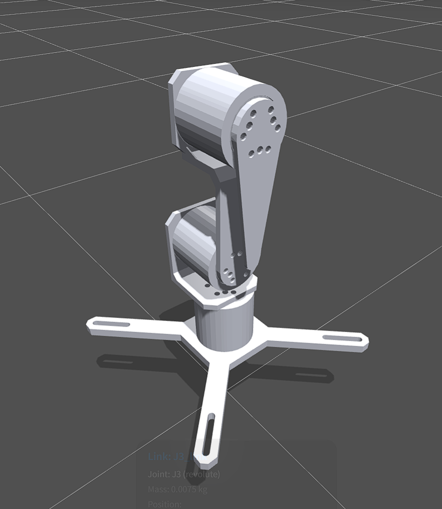
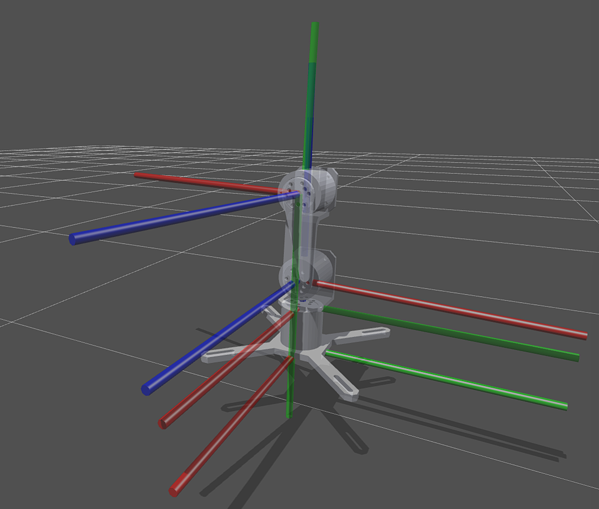

# 机器人运动学（基础）

> 仅涉及最基础知识点,用于快速入门：坐标系的建立、D-H参数表、正运动学（FK）和逆运动学（IK）。

## 0. 正逆运动学

- **正运动学（Forward Kinematics, FK）**：知关节角度求解末端位置
  控制电机时就是不断改角度，算末端会到哪。

- **逆运动学（Inverse Kinematics, IK）**：已知想要的末端位置/姿态，反推出每个关节该转多少度。
  这是想让末端到那个点必须做的。

两者是相反的过程。IK 麻烦得多，因为：

1. 一个末端位置可能对应多组关节角（多解）；
2. 可能无解（超出工作空间）；
3. 一般难解（非线性、三角方程）。

一般机器人偏向解析解设计——结构能写出解析解，就不用去跑数值迭代了。

---

## 1. 建立坐标系

给每个连杆绑一个坐标系，然后描述相邻坐标系之间的关系。

最常见的是 D-H 表示法。它要求每个坐标系 `i` 的 `z` 轴沿着关节 `i` 的**旋转轴**。

这是整套约定里唯一不能妥协的规则。

剩下可以约定x或者y有都尽可能的 各自 相同 的 指向 一个 方向。

可以按照下面方式建

### 1.1 找关节轴

每个转动关节有一条旋转轴。从基座往末端数，第 1、2、3...根轴就是 `z0, z1, z2...`。

### 1.2 定原点

坐标系 `i` 的原点放在**关节轴 `z_i` 与相邻轴 `z_{i-1}` 的公垂线**与 `z_i` 的交点。

- 如果两根轴相交，原点就放在交点。
- 如果两根轴平行，公垂线随便取，一般取对结构最直观的位置。

### 1.3 定坐标轴方向（D-H 的核心规则）

设坐标系 `i` 的轴为 `x_i, y_i, z_i`：

- `z_i`：沿关节 `i` 的旋转轴（固定规则）。
- `x_i`：沿 `z_{i-1}` 到 `z_i` 的公垂线方向。
- `y_i`：由右手定则补全：`y_i = z_i × x_i`。

### 1.4 基座坐标系（frame 0）

`z0` 沿关节 1 的旋转轴。

- 原点一般放在基座底面中心或关节 1 的轴线上，直观为好。
- `x0, y0`随意，直观为好。
- 姿态计算以基座坐标系为准。

### 1.5 末端坐标系（tool frame）

- 建在末端执行器上，`z` 一般沿夹爪方向。

---

## 2. D-H 参数表

D-H 用四个参数描述相邻坐标系 `i-1` 到 `i` 的变换：

| 符号 | 名字 | 含义 | 怎么确定 |
|---|---|---|---|
| `θ_i` | 关节角 | 绕 `z_{i-1}` 的转角（转动关节的变量） | 变量，就是我们的 `q` |
| `d_i` | 连杆偏置 | 沿 `z_{i-1}` 的距离 | 量相邻两轴的沿轴距离 |
| `a_i` | 连杆长度 | 沿 `x_i` 的距离（公垂线长度） | 量 `z_{i-1}` 到 `z_i` 的垂直距离 |
| `α_i` | 连杆扭角 | 绕 `x_i` 的转角（从 `z_{i-1}` 转到 `z_i`） | 量两轴之间的夹角 |

### 2.1 填表

- `θ` 是转动关节，`d, a, α`是由机械结构决定的常量。
- `α_i` 是绕 `x_i` 把 `z_{i-1}` 转到 `z_i` 的角，不是绕某个轴的简单夹角，要看正负。

### 2.2 举例

一个三自由度的测试用机械臂




---

这台臂是"转台(J1) + 肩俯仰(J2) + 肘俯仰(J3)"的结构，J2、J3 轴平行、都在水平面内，表很规整：

| i | 关节 | θ_i | d_i | a_i | α_i | 说明 |
|---|------|-----|-----|-----|-----|------|
| 1 | 转台 J1 | q1 | 0.084 | 0 | +90° | d1=肩关节高度 |
| 2 | 肩 J2 | q2 | 0 | 0.094 | 0° | a2=大臂长（肩→肘） |
| 3 | 肘 J3 | q3 | ≈0.016 | 0 | 0° | d3=J3_link 原点沿 J3 轴的偏置 |

模型文件见（assets/机械臂/cad/）：

- `d1 = 0.084`：J2 关节原点 z = 0.051 + 0.033 = 0.084，就是肩关节高度。
- `a1 = 0`：转台轴(J1)和肩轴(J2)在肩关节处相交，公垂线长度 = 0。所以 IK 里的 `offset_x = 0`。
- `a2 = 0.094`：肩→肘间距。J3 关节原点在 J2_link 系里是 (0, 0.093, 0.014)，所以 √(0.093² + 0.014²) ≈ 0.094。
- `d3 ≈ 0.016`：J3_link 的 frame 原点在肘关节沿 J3 轴偏出 0.0156，属于 `d` 不是 `a`。
- `α1 = ±90°`：z0 竖直、z1 水平，垂直相交。正负是自由约定，只影响 q 的旋转方向。
- `α2 = α3 = 0`：J2 轴和 J3 轴平行。

### 2.4 注意

- URDF 的 `<axis>` 是"关节坐标系"里的方向，不是世界方向。 J2 写的是 `<axis xyz="0 0 -1"/>`，其实乘上关节的 `rpy` 才是真实方向——它是水平轴（肩的俯仰轴）。
- "标准 D-H"还是"修正 D-H"要对齐。给的那个矩阵是标准 D-H，不是修正 D-H。
- 仅供一个参考，方便演示


---

## 3. 正运动学（FK）

### 3.1 相邻坐标系的变换矩阵

在 D-H 约定下，从坐标系 `i-1` 到 `i` 的齐次变换矩阵是：

```
T_i = Rz(θ_i) * Transz(d_i) * Transx(a_i) * Rx(α_i)
```

展开成 4×4 矩阵（`cθ=cosθ, sθ=sinθ`，余类推）：

```
        | cθ   -sθ·cα    sθ·sα    a·cθ  |
T_i  =  | sθ    cθ·cα   -cθ·sα    a·sθ  |
        | 0      sα       cα      d     |
        | 0      0        0       1     |
```

### 3.2 从基座到末端连乘

末端坐标系 `n` 相对基座 `0` 的位姿：

```
T_0n = T_1 · T_2 · T_3 · ... · T_n
```

对三自由度臂就是 `T_03 = T_1(q1) · T_2(q2) · T_3(q3)`。把每个 `q` 代进去，乘出来就是末端位置 `(px, py, pz)` 和姿态（旋转矩阵）。

这就是 FK：给定 `q`，一顿矩阵乘法，得到末端位姿。计算机里就是循环乘矩阵。

---

## 4. 逆运动学（IK）

### 4.1 两种思路

| 方法 | 优点 | 缺点 | 适用 |
|---|---|---|---|
| 解析解（封闭解） | 快、精确、无迭代、可穷举所有解 | 要推导，结构复杂时推不出来 | 结构规整、关节少的臂 |
| 数值解（迭代） | 通用，啥臂都行 | 慢、可能收敛到局部解、要选初值 | 冗余/复杂臂、实时性不敏感 |

### 4.2 思路：拆成"转台 + 平面二连杆"

以上面的机械臂为例，这台能够拆解出解析解

因为`J2`、`J3`轴平行且水平：不管`J1`转到哪，整条臂都躺在同一个竖直平面里。于是 3 自由度空间 IK 就拆成两个小问题：

**解 `q1`——让臂所在竖直平面对准目标**

`J1` 只绕竖直轴转，和末端高度无关，所以只看末端在水平面的投影就能定出方位角：

```
q1 = atan2(py, px)
```

**在竖直平面里解平面二连杆**

`q1` 定了，臂面就固定。把这个竖直平面当成 2D 平面：水平向外是 `x`、竖直向上是 `z`。先把目标从基座系换算到**肩关节原点**，得到平面内目标 `(x̄, z̄)`：

```
x̄  = √(px²+py²) - offset_x
z̄  = pz - offset_z
r² = x̄² + z̄²
```

`offset_x, offset_z` 是肩关节原点在基座系里的位置（这台臂 `offset_x=0`、`offset_z=0.084`，取自 D-H/URDF）。

之后就是标准的两连杆平面 IK：`L1`=大臂=`a2`，`L2`=小臂=`a3`（"肘→末端"距离），用余弦定理：

```
cos(q3) = (r² - L1² - L2²) / (2·L1·L2)                        // 肘角
q2      = atan2(z̄, x̄) - atan2(L2·sin(q3), L1 + L2·cos(q3))   // 肩角
```

**多解与取舍**

- 肘角 `q3` 一般有两个解（肘朝上 / 肘朝下，来自 `cos` 的 `±`）；
- 每个 `q3` 对应一个 `q2`，所以肩角也有两个；
- 一个末端位置最多对应 4 组 `(q1, q2, q3)`，要挑：
  - **在关节软限位内**的（我们 ±135° = ±2.356 rad）；
  - 避开奇异点/碰撞的；
  - 靠近当前姿态、跳变最小的。

**用 FK 回代验证**

解出来再跑一次正运动学，看末端是否真的到了目标点。**一定要互相验证**——D-H 或几何差一点，回代立刻就会暴露。这是写 IK 最稳的流程。

> 平面二连杆成立的前提是两俯仰轴平行且水平；若真实臂不满足这个条件，就得走通用数值解。

---

实际上手注意映射电机零位和模型零位的区别，注意调零

这些毕竟就是个基础，实际知道有个这个东西就好，这里的好多东西实际是有库，不需要人来干的。

还可以让ai来算嘛
